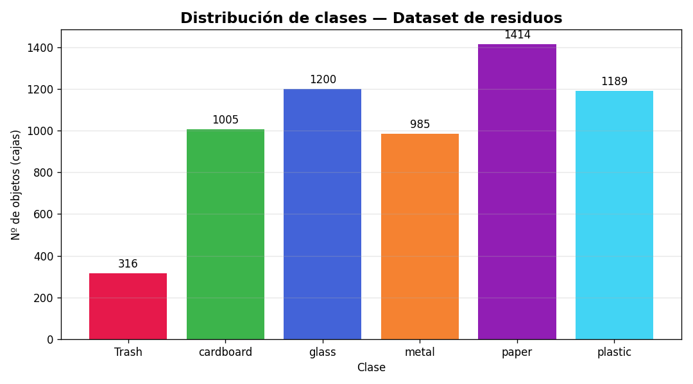
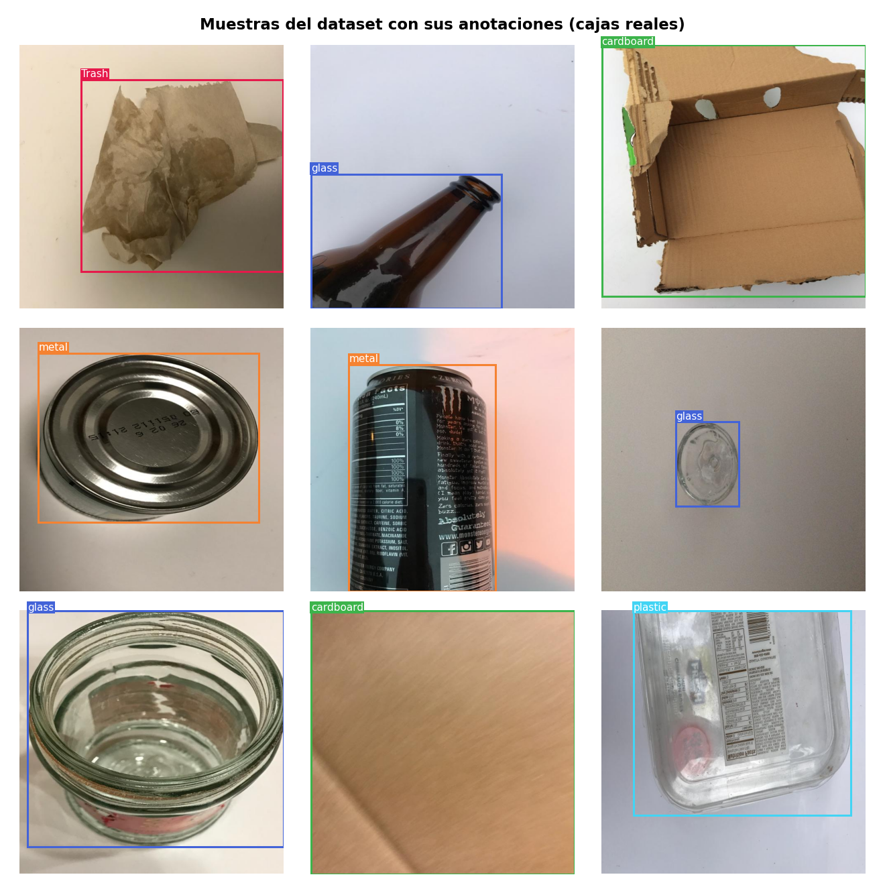

# 📊 Exploración de Datos (EDA)

Análisis del dataset **YOLOv8 Trash Detection** (v3, Roboflow, CC BY 4.0) usado
para detección de residuos. Reproducible con `py src/analizar_clases.py`.

## Resumen del dataset

| Partición | Imágenes | Objetos | Objetos/imagen |
|-----------|----------|---------|----------------|
| train (aumentado) | 5,301 | 5,340 | 1.01 |
| valid | 328 | 337 | 1.03 |
| test | 432 | 432 | 1.00 |
| **Total** | **6,061** | **6,109** | **~1.0** |

> El conjunto de entrenamiento viene con *data augmentation* aplicado por Roboflow.

## Distribución de clases (objetos por clase)

| Clase | train | valid | test | TOTAL | % |
|-------|------:|------:|-----:|------:|--:|
| paper | 1,218 | 89 | 107 | **1,414** | 23.1% |
| glass | 1,053 | 64 | 83 | **1,200** | 19.6% |
| plastic | 1,053 | 62 | 74 | **1,189** | 19.5% |
| cardboard | 885 | 49 | 71 | **1,005** | 16.5% |
| metal | 861 | 56 | 68 | **985** | 16.1% |
| Trash | 270 | 17 | 29 | **316** | 5.2% |

## Hallazgos clave

1. **Objetos individuales (~1.0 obj/imagen):** cada imagen contiene esencialmente
   un único residuo. Esto simplifica el problema (cercano a "clasificación con
   localización") y favorece buenos resultados con un modelo base. Una posible
   mejora futura sería detectar varios residuos por escena.

2. **Desbalance de clases (ratio 4.5x):** la clase `Trash` (basura general) está
   subrepresentada (5.2% del total) frente a `paper` (23.1%).
   - **Implicación:** es probable que el *recall* de `Trash` sea menor.
   - **Cómo lo abordamos:** reportaremos métricas **por clase** (no solo el mAP
     global), y consideraremos *augmentation* adicional o ajuste de pesos si hace
     falta. YOLO es relativamente robusto al desbalance moderado.

3. **Particiones coherentes:** la proporción entre clases se mantiene similar en
   train/valid/test, lo que indica una división estratificada correcta.

4. **Objetos grandes y centrados:** en las muestras se observa que cada residuo
   ocupa gran parte de la imagen y suele estar centrado. El modelo aprenderá
   objetos prominentes; en la demo conviene acercar el residuo a la cámara.

## Visualizaciones

**Distribución de clases:**

**Muestras del dataset con sus anotaciones (cajas reales):**

> Generadas con `.venv\Scripts\python.exe src\visualizar_muestras.py`.

## Implicaciones para el entrenamiento

- Empezaremos con un modelo **YOLO nano** (rápido) como línea base.
- Métrica principal: **mAP@0.5** y **mAP@0.5:0.95**, además de precisión/recall
  **por clase** para no esconder el comportamiento de `Trash`.
- La matriz de confusión nos dirá si se confunden clases visualmente parecidas
  (p. ej. `plastic` vs `glass`, o `paper` vs `cardboard`).
